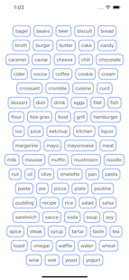

# Flexible Picker

The implementation of custom Flexible Picker. Thanks to that view component we can create selectable view with many options to select from. Moreover, it is a reusable and flexible component, as we can provide many different data types as input, as long as they are conforming to Selectable protocol.
 

  

 

## Customization
Flexible Picker is full customizable, as we can change:

- subviews alignment
- border color
- text color
- background color
- font size and weight
- selected background color
- disable selection

## Implementation description

The implementation has been described in the Medium's article: 
https://betterprogramming.pub/flexible-picker-with-swiftui-5817ffe9fddf

## Libraries

- SwiftUI

## License

MIT
